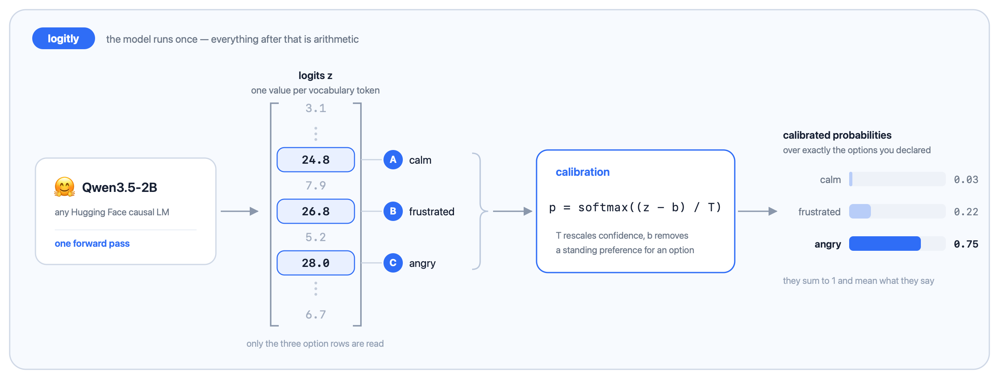
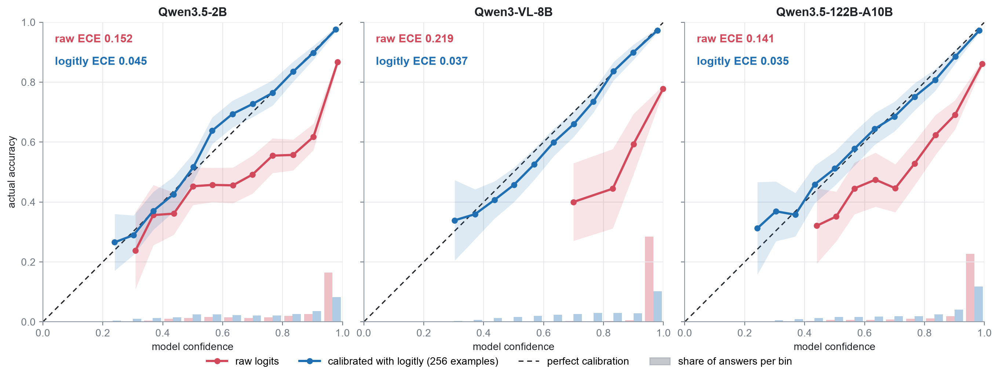
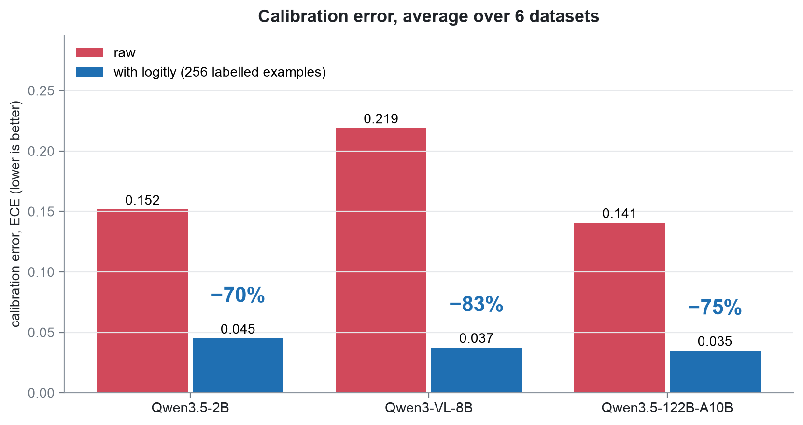
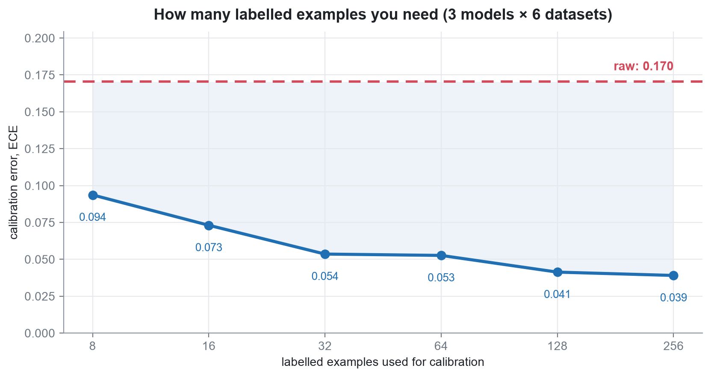

# logitly

Just like Jev: you ask an LLM to answer a question by picking one of the available options (A, B, C), and along with the chosen option you get a probability you can actually trust.



A probability an LLM writes out as text is just more generated text: nothing ties it to how often the model is right. The softmax over the option logits (the naive way to recreate Jev) is a real signal, but it is overconfident

logitly calibrates these probabilities on a few dozen labelled examples, so that they match how often the model is actually right.

## Install

Python 3.10 or newer. The base install is small: numpy, pydantic and httpx.

```bash
pip install git+https://github.com/mxm0312/logitly.git
```

To run local weights, add the `hf` extra, which brings torch and transformers:

```bash
pip install "logitly[hf] @ git+https://github.com/mxm0312/logitly.git"
```

If you care which torch build you get (CPU-only, or a particular CUDA version),
install it first from [pytorch.org](https://pytorch.org/get-started/locally/) and
then run the line above.

## Example

```python
from logitly import Logitly, Choice

llm = Logitly("Qwen/Qwen2.5-1.5B-Instruct")

tone = Choice(
    instructions="What is the customer's tone?",
    options=["calm", "frustrated", "angry"],
)

answer = llm.ask(tone, "I was charged twice. Fix this today.")

answer.label       # 'angry'
answer.probs       # {'calm': 0.03, 'frustrated': 0.22, 'angry': 0.75}
answer.confidence  # 0.75
answer.margin      # gap to the runner-up
```

## Calibrate

```python
data = [
    {"input": "Works exactly as described.", "answer": "positive"},
    {"input": "Broke on the first day.",     "answer": "negative"},
    # a few dozen to a few hundred
]

report = llm.calibrate(question, data)   # fits, prints a report

llm.ask(question, "The zip broke in a week.")   # calibrated from here on
report.improved                                  # did held-out NLL go down?
```

## Example: Served models

Anything speaking the OpenAI chat API — vLLM, OpenAI, and the rest. No
tokenizer, no weights: options are matched by the text of the returned tokens.

```python
llm = Logitly.from_api("Qwen/Qwen2.5-7B-Instruct", "http://my-host:8000/v1")
```

## Benchmark

Datasets:
- [ag_news](https://huggingface.co/datasets/fancyzhx/ag_news) (4 classes)
- [trec](https://huggingface.co/datasets/CogComp/trec) (6 classes)
- [emotion](https://huggingface.co/datasets/dair-ai/emotion) (6 classes)
- [tweet_eval](https://huggingface.co/datasets/cardiffnlp/tweet_eval) (3 classes)
- [dbpedia](https://huggingface.co/datasets/fancyzhx/dbpedia_14) (14 classes)
- [yahoo](https://huggingface.co/datasets/community-datasets/yahoo_answers_topics) (10 classes)

| model | calibration error (ECE) | log-loss (NLL) |
|---|---|---|
| [Qwen3.5-2B](https://huggingface.co/Qwen/Qwen3.5-2B) | 0.152 → **0.045** (−70%) | −29% |
| [Qwen3-VL-8B](https://huggingface.co/Qwen/Qwen3-VL-8B-Instruct) | 0.219 → **0.037** (−83%) | −80% |
| [Qwen3.5-122B-A10B](https://huggingface.co/Qwen/Qwen3.5-122B-A10B) | 0.141 → **0.035** (−75%) | −28% |

A more detailed overview is in [benchmark/README.md](benchmark/README.md).



**Calibration error drops by 70–83% on every model.**



**Use at least 32 calibration examples.**

On our datasets, 32 examples already cut the calibration error by 69%. With 8–16 examples, calibration can occasionally make things worse :)



To reproduce:

```bash
cd benchmark && make setup && make all     # make on its own lists every target
```

## API

| | |
|---|---|
| `Logitly(model, **load_kwargs)` | Hub id, local path, or a `Backend`. |
| `Logitly.from_api(model, base_url, api_key=None)` | OpenAI-compatible endpoint. |
| `llm.ask(question, state)` | One `Answer`. |
| `llm.ask_many(question, states)` | Batched list of `Answer`. |
| `llm.ask_all(questions, state)` | Several questions about one input, as a dict. |
| `llm.scores(question, states)` | Raw `(n, n_options)` scores. |
| `llm.calibrate(question, data)` | Fit, attach, report. |
| `llm.render(question, state)` | The prompt string. |

**Questions** — `Choice`, `Bool` (`answer.value` is a `bool`), `Score` (ordered
levels; `answer.expected_score` is the probability-weighted position).

**Answer** — `label`, `index`, `probs`, `raw_probs`, `scores`, `confidence`,
`margin`, `ranking`, `calibrated`.

**Config** — `PromptConfig`, `FitConfig`, `CalibrationConfig`, `ApiConfig`.
Pydantic models, so they validate and serialise.

## License

MIT.
