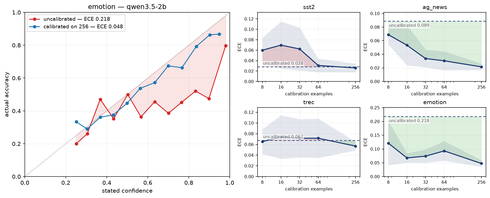

# logitly

Just like Jev, you ask an LLM to answer a question by picking one of the available options (A, B, C). but along with the chosen option, you get a real probability you can actually trust


it's no secret that a probability an LLM makes up is a scam. and so is the probability you get from the logit of the matching option (the naive way to recreate Jev)

this tool uses calibration to make naive open-source Jev spit out probabilities that actually match reality


## Install

Python 3.10 or newer. The base install is small: numpy, pydantic and httpx

```bash
pip install git+https://github.com/mxm0312/logitly.git
```

To run local weights, add the `hf` extra, which brings torch and transformers:

```bash
pip install "logitly[hf] @ git+https://github.com/mxm0312/logitly.git"
```

If you care which torch build you get: CPU-only, or a particular CUDA
install it first from [pytorch.org](https://pytorch.org/get-started/locally/) and
then the line above

## Example

```python
from logitly import Logitly, Choice

llm = Logitly("Qwen/Qwen2.5-1.5B-Instruct")

tone = Choice(
    instructions="What is the customer's tone?",
    options=["calm", "frustrated", "angry"],
)

answer = llm.ask(tone, "I was charged twice. Fix this today.")

answer.label       # 'angry'
answer.probs       # {'calm': 0.03, 'frustrated': 0.22, 'angry': 0.75}
answer.confidence  # 0.75
answer.margin      # gap to the runner-up
```

## Calibrate

```python
data = [
    {"input": "Works exactly as described.", "answer": "positive"},
    {"input": "Broke on the first day.",     "answer": "negative"},
    # a few dozen to a few hundred
]

report = llm.calibrate(question, data)   # fits, prints a report

llm.ask(question, "The zip broke in a week.")   # calibrated from here on
report.improved                                  # did held-out NLL go down?
```

## Example: Served models

Anything speaking the OpenAI chat API — vLLM, OpenAI, and the rest. No
tokenizer, no weights: options are matched by the text of the returned tokens.

```python
llm = Logitly.from_api("Qwen/Qwen2.5-7B-Instruct", "http://my-host:8000/v1")
```

## Benchmarks

Below you can see the results on 4 datasets:
- [sst2](https://huggingface.co/datasets/stanfordnlp/sst2) — movie-review sentiment, 2 classes
- [ag_news](https://huggingface.co/datasets/fancyzhx/ag_news) — newspaper section, 4 classes
- [trec](https://huggingface.co/datasets/CogComp/trec) — what a question asks for, 6 classes
- [emotion](https://huggingface.co/datasets/dair-ai/emotion) — emotion in a short message, 6 classes

measured with [Qwen3.5-2B](https://huggingface.co/Qwen/Qwen3.5-2B).



Qwen3.5-2B on four classification sets, calibration fitted on 8 to 256 labelled
examples, five seeds each, measured on a held-out split of 500 to 1000 examples
the fit never sees.

| dataset | model | accuracy | NLL | ECE | Brier | changed |
|---|---|---|---|---|---|---|
| sst2 | qwen3.5-2b | 0.881 → 0.906 (+0.025) ✓ | 0.269 → 0.252 (-0.017) ✓ | 0.028 → 0.026 (-0.002) ✓ | 0.159 → 0.143 (-0.016) ✓ | 7.7% |
| ag_news | qwen3.5-2b | 0.835 → 0.864 (+0.029) ✓ | 0.607 → 0.405 (-0.202) ✓ | 0.089 → 0.022 (-0.067) ✓ | 0.260 → 0.207 (-0.053) ✓ | 8.7% |
| trec | qwen3.5-2b | 0.766 → 0.802 (+0.036) ✓ | 0.779 → 0.657 (-0.123) ✓ | 0.067 → 0.057 (-0.011) ✓ | 0.360 → 0.298 (-0.062) ✓ | 16.1% |
| emotion | qwen3.5-2b | 0.562 → 0.566 (+0.004) ✓ | 1.516 → 1.190 (-0.326) ✓ | 0.218 → 0.048 (-0.170) ✓ | 0.656 → 0.570 (-0.086) ✓ | 11.4% |

Calibration buys a large drop in NLL, ECE and Brier, and a smaller but real gain
in accuracy. Those accuracy points come from the per-option bias, not the
temperature: `T` is monotone per option and cannot change which option wins.

<details>
<summary>Every calibration size, mean ± std over five seeds</summary>

**sst2** — Is this movie review positive or negative? `stanfordnlp/sst2`

| calibration | accuracy | NLL | ECE | Brier | mean confidence | predictions changed |
|---|---|---|---|---|---|---|
| raw | 0.881 | 0.269 | 0.028 | 0.159 | 0.886 | 0.0% |
| calibrated n=8 | 0.894 ± 0.013 | 0.345 ± 0.095 | 0.060 ± 0.024 | 0.167 ± 0.028 | 0.947 ± 0.012 | 3.2% ± 1.5% |
| calibrated n=16 | 0.903 ± 0.004 | 0.315 ± 0.039 | 0.070 ± 0.045 | 0.159 ± 0.017 | 0.909 ± 0.083 | 7.5% ± 3.1% |
| calibrated n=32 | 0.900 ± 0.011 | 0.301 ± 0.069 | 0.062 ± 0.041 | 0.159 ± 0.021 | 0.904 ± 0.071 | 6.0% ± 4.0% |
| calibrated n=64 | 0.906 ± 0.002 | 0.268 ± 0.048 | 0.031 ± 0.013 | 0.147 ± 0.004 | 0.913 ± 0.026 | 8.7% ± 2.1% |
| calibrated n=256 | 0.906 ± 0.001 | 0.252 ± 0.014 | 0.026 ± 0.008 | 0.143 ± 0.001 | 0.916 ± 0.017 | 7.7% ± 0.5% |

**ag_news** — Which section of the newspaper does this story belong to? `fancyzhx/ag_news`

| calibration | accuracy | NLL | ECE | Brier | mean confidence | predictions changed |
|---|---|---|---|---|---|---|
| raw | 0.835 | 0.607 | 0.089 | 0.260 | 0.922 | 0.0% |
| calibrated n=8 | 0.854 ± 0.003 | 0.508 ± 0.050 | 0.069 ± 0.014 | 0.233 ± 0.005 | 0.844 ± 0.077 | 3.0% ± 1.0% |
| calibrated n=16 | 0.859 ± 0.005 | 0.532 ± 0.136 | 0.053 ± 0.030 | 0.227 ± 0.009 | 0.900 ± 0.042 | 4.7% ± 1.0% |
| calibrated n=32 | 0.858 ± 0.006 | 0.450 ± 0.021 | 0.034 ± 0.013 | 0.223 ± 0.009 | 0.846 ± 0.032 | 5.4% ± 2.1% |
| calibrated n=64 | 0.865 ± 0.002 | 0.423 ± 0.006 | 0.030 ± 0.014 | 0.212 ± 0.002 | 0.876 ± 0.023 | 7.7% ± 1.6% |
| calibrated n=256 | 0.864 ± 0.002 | 0.405 ± 0.004 | 0.022 ± 0.005 | 0.207 ± 0.001 | 0.870 ± 0.004 | 8.7% ± 0.6% |

**trec** — What kind of answer does this question ask for? `CogComp/trec`

| calibration | accuracy | NLL | ECE | Brier | mean confidence | predictions changed |
|---|---|---|---|---|---|---|
| raw | 0.766 | 0.779 | 0.067 | 0.360 | 0.754 | 0.0% |
| calibrated n=8 | 0.802 ± 0.010 | 0.770 ± 0.102 | 0.065 ± 0.023 | 0.314 ± 0.003 | 0.820 ± 0.057 | 9.6% ± 1.5% |
| calibrated n=16 | 0.806 ± 0.008 | 0.669 ± 0.038 | 0.074 ± 0.041 | 0.305 ± 0.015 | 0.749 ± 0.047 | 12.2% ± 3.8% |
| calibrated n=32 | 0.797 ± 0.010 | 0.692 ± 0.050 | 0.071 ± 0.036 | 0.310 ± 0.011 | 0.750 ± 0.051 | 14.1% ± 2.4% |
| calibrated n=64 | 0.804 ± 0.007 | 0.677 ± 0.049 | 0.072 ± 0.037 | 0.305 ± 0.018 | 0.744 ± 0.051 | 14.6% ± 1.6% |
| calibrated n=256 | 0.802 ± 0.004 | 0.657 ± 0.018 | 0.057 ± 0.008 | 0.298 ± 0.005 | 0.761 ± 0.010 | 16.1% ± 0.8% |

**emotion** — Which emotion does this message express? `dair-ai/emotion`

| calibration | accuracy | NLL | ECE | Brier | mean confidence | predictions changed |
|---|---|---|---|---|---|---|
| raw | 0.562 | 1.516 | 0.218 | 0.656 | 0.773 | 0.0% |
| calibrated n=8 | 0.555 ± 0.006 | 1.324 ± 0.147 | 0.121 ± 0.081 | 0.613 ± 0.038 | 0.655 ± 0.094 | 6.3% ± 2.3% |
| calibrated n=16 | 0.564 ± 0.002 | 1.231 ± 0.015 | 0.068 ± 0.017 | 0.585 ± 0.006 | 0.585 ± 0.054 | 4.0% ± 2.0% |
| calibrated n=32 | 0.560 ± 0.010 | 1.222 ± 0.014 | 0.074 ± 0.024 | 0.585 ± 0.008 | 0.623 ± 0.033 | 8.6% ± 3.2% |
| calibrated n=64 | 0.558 ± 0.007 | 1.241 ± 0.052 | 0.093 ± 0.036 | 0.590 ± 0.018 | 0.643 ± 0.035 | 8.8% ± 1.9% |
| calibrated n=256 | 0.566 ± 0.004 | 1.190 ± 0.004 | 0.048 ± 0.012 | 0.570 ± 0.002 | 0.608 ± 0.012 | 11.4% ± 1.1% |

</details>

Run it yourself, or point it at your own models and datasets through
`benchmark/config.yml`:

```bash
cd benchmark && make setup && make all     # make on its own lists every target
```

## API

| | |
|---|---|
| `Logitly(model, **load_kwargs)` | Hub id, local path, or a `Backend`. |
| `Logitly.from_api(model, base_url, api_key=None)` | OpenAI-compatible endpoint. |
| `llm.ask(question, state)` | One `Answer`. |
| `llm.ask_many(question, states)` | Batched list of `Answer`. |
| `llm.ask_all(questions, state)` | Several questions about one input, as a dict. |
| `llm.scores(question, states)` | Raw `(n, n_options)` scores. |
| `llm.calibrate(question, data)` | Fit, attach, report. |
| `llm.render(question, state)` | The prompt string. |

**Questions** — `Choice`, `Bool` (`answer.value` is a `bool`), `Score` (ordered
levels; `answer.expected_score` is the probability-weighted position).

**Answer** — `label`, `index`, `probs`, `raw_probs`, `scores`, `confidence`,
`margin`, `ranking`, `calibrated`.

**Config** — `PromptConfig`, `FitConfig`, `CalibrationConfig`, `ApiConfig`.
Pydantic models, so they validate and serialise.

## License

MIT.
