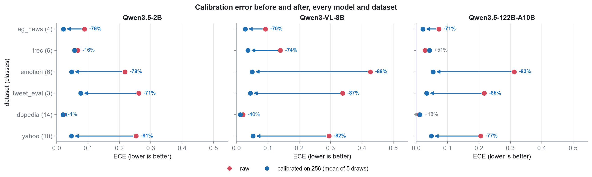
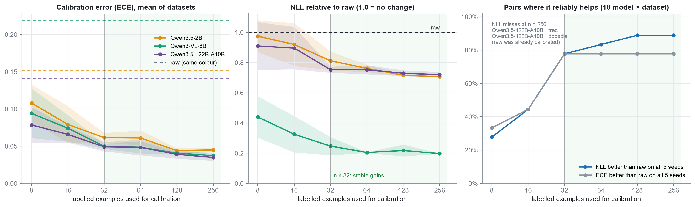
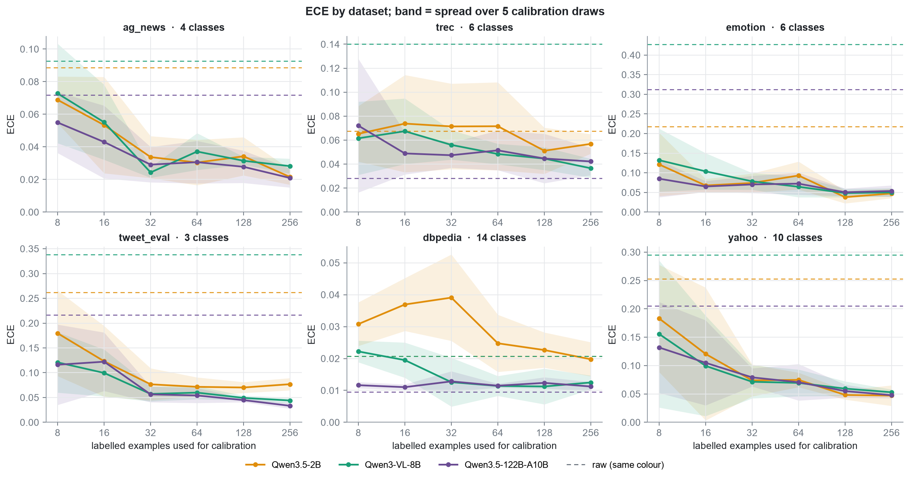
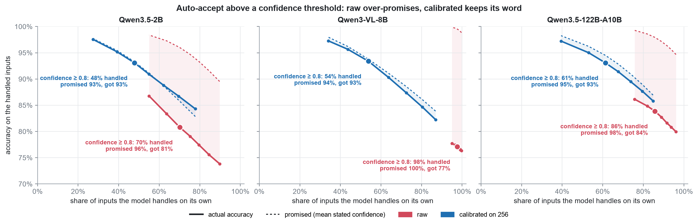

# Benchmark results

Does fitting `p = softmax((z − b) / T)` on a handful of labelled examples make an
LLM classifier's probabilities trustworthy? Three models, six datasets,
calibration sets of 8 to 256 examples, five random draws of each.

How to run it, the layout and the config: [RUNNING.md](RUNNING.md).

| | |
|---|---|
| models | **Qwen3.5-2B** (local weights) · **Qwen3-VL-8B-Instruct** · **Qwen3.5-122B-A10B** (GPTQ-Int4) |
| datasets | ag_news (4 classes) · trec (6) · emotion (6) · tweet_eval (3) · dbpedia (14) · yahoo (10) |
| test set | 1000 held-out examples per dataset (trec: 500, its whole test split), identical for every model |
| calibration | n ∈ {8, 16, 32, 64, 128, 256}, drawn from a separate pool of 512, 5 seeds per size |
| raw | softmax over the option logits, no fitting |
| metrics | ECE (15 bins, top-label), NLL, Brier, accuracy, share of decisions flipped |

"Calibrated" means n = 256, mean of the five draws, unless a size is given.

## Findings

- **ECE −70% / −83% / −75%** (2B / VL-8B / 122B), down to 0.035–0.045 on average.
  NLL −29% / −80% / −28%, Brier −19% / −23% / −12%.
- **Size does not fix overconfidence.** Raw ECE: 122B 0.141 ≈ 2B 0.152. On
  emotion 122B is worse than 2B (0.312 vs 0.218).
- **Raw models over-promise.** Mean confidence is above accuracy by 13 / 22 / 13
  points. After calibration the gap is ≤ 2 points.
- **VL-8B is the most overconfident**: raw confidence 0.97–0.999 on every dataset.
  Fitted T is 4.4–12.9, against 1.0–2.1 (2B) and 1.0–3.2 (122B).
- **n ≥ 32 is reliable.** From 32 on, all 5 draws beat raw NLL on all 14 pairs with
  raw ECE ≥ 0.05. Mean ECE: 0.170 raw → 0.094 (n=8) → 0.054 (n=32) → 0.039 (n=256).
- **n = 8–16 is a gamble.** Only 28% (n=8) and 44% (n=16) of the pairs have all 5
  draws beat raw NLL. At n = 8 the mean NLL is above raw on 2B·dbpedia (1.23×),
  122B·trec (1.19×) and 122B·dbpedia (1.11×).
- **Accuracy comes from the bias `b`** (`T` cannot change the winner). 2B·tweet_eval
  +16.8 pp (35% of decisions flipped), 122B·tweet_eval +5.9 pp, 2B·trec +3.6 pp.
  VL-8B flips ≤ 1% except tweet_eval: its problem is temperature. No accuracy drop
  above 0.1 pp.
- **Nothing to fix where raw is already calibrated.** 122B·trec (raw ECE 0.028)
  and 122B·dbpedia (0.010): NLL unchanged (1.00×, 1.04×), ECE slightly up (+0.014,
  +0.002). `report.improved` (held-out NLL) flags this case.
- **Thresholds start to mean something.** At confidence ≥ 0.8: raw promises
  96–99.5%, delivers 77–84%. Calibrated promises 93–95%, delivers 93%.

## Reliability

Each point is a confidence bin: how sure the model said it was, against how often
it was right. All six datasets pooled; the shading is a 95% interval; bins with
under 0.5% of the answers are not drawn. Raw VL-8B has few points because 95% of
its answers land in the top bin.

## Calibration error per model and dataset

## Results per model

Raw → calibrated. *Flipped* is the share of test decisions calibration changed.

**Qwen3.5-2B**

| dataset | ECE | NLL | Brier | accuracy | flipped |
|---|---|---|---|---|---|
| ag_news | 0.089 → 0.022 | 0.607 → 0.405 | 0.260 → 0.207 | 0.835 → 0.864 | 8.7% |
| trec | 0.067 → 0.057 | 0.779 → 0.657 | 0.360 → 0.298 | 0.766 → 0.802 | 16.1% |
| emotion | 0.218 → 0.048 | 1.516 → 1.190 | 0.656 → 0.570 | 0.562 → 0.566 | 11.4% |
| tweet_eval | 0.262 → 0.077 | 1.260 → 0.683 | 0.673 → 0.417 | 0.540 → 0.708 | 35.2% |
| dbpedia | 0.021 → 0.020 | 0.280 → 0.210 | 0.084 → 0.075 | 0.949 → 0.953 | 1.3% |
| yahoo | 0.253 → 0.047 | 1.980 → 1.284 | 0.637 → 0.526 | 0.595 → 0.621 | 13.7% |

**Qwen3-VL-8B**

| dataset | ECE | NLL | Brier | accuracy | flipped |
|---|---|---|---|---|---|
| ag_news | 0.093 → 0.028 | 1.570 → 0.321 | 0.186 → 0.154 | 0.903 → 0.903 | 0.5% |
| trec | 0.140 → 0.037 | 1.994 → 0.453 | 0.287 → 0.221 | 0.850 → 0.859 | 1.0% |
| emotion | 0.427 → 0.050 | 8.839 → 1.274 | 0.861 → 0.606 | 0.560 → 0.562 | 0.8% |
| tweet_eval | 0.338 → 0.044 | 4.812 → 0.743 | 0.689 → 0.445 | 0.636 → 0.667 | 7.9% |
| dbpedia | 0.021 → 0.012 | 0.362 → 0.097 | 0.040 → 0.036 | 0.980 → 0.980 | 0.0% |
| yahoo | 0.295 → 0.053 | 5.863 → 1.095 | 0.603 → 0.464 | 0.686 → 0.688 | 0.6% |

**Qwen3.5-122B-A10B**

| dataset | ECE | NLL | Brier | accuracy | flipped |
|---|---|---|---|---|---|
| ag_news | 0.072 → 0.021 | 0.516 → 0.315 | 0.173 → 0.149 | 0.903 → 0.908 | 2.7% |
| trec | 0.028 → 0.042 | 0.251 → 0.251 | 0.109 → 0.109 | 0.938 → 0.937 | 1.2% |
| emotion | 0.312 → 0.054 | 2.213 → 1.205 | 0.724 → 0.576 | 0.572 → 0.580 | 7.6% |
| tweet_eval | 0.217 → 0.033 | 1.257 → 0.677 | 0.543 → 0.403 | 0.650 → 0.709 | 20.9% |
| dbpedia | 0.010 → 0.011 | 0.056 → 0.058 | 0.024 → 0.025 | 0.985 → 0.986 | 0.3% |
| yahoo | 0.205 → 0.048 | 1.746 → 1.030 | 0.480 → 0.424 | 0.722 → 0.721 | 3.6% |

Every calibration size, with ± over the five draws, is in the per-dataset reports:
[ag_news](results/ag_news/report.md) · [trec](results/trec/report.md) ·
[emotion](results/emotion/report.md) · [tweet_eval](results/tweet_eval/report.md) ·
[dbpedia](results/dbpedia/report.md) · [yahoo](results/yahoo/report.md).

## How many labelled examples

Left: ECE, mean of datasets; dashed = raw. Middle: NLL as a ratio to raw. Right:
share of the 18 model × dataset pairs where all five draws beat raw. Bands are the
spread over the five draws.

## Auto-accepting confident answers

Handle everything above a confidence threshold automatically, send the rest to a
person. *Handled*: share of inputs above the cut-off. *Promised*: their mean
confidence. *Actual*: their accuracy. All datasets pooled.

| model | cut-off | raw: handled / promised / actual | calibrated: handled / promised / actual |
|---|---|---|---|
| Qwen3.5-2B | ≥ 0.800 | 70% / 96.0% / **80.8%** | 48% / 93.3% / **93.1%** |
| Qwen3.5-2B | ≥ 0.933 | 55% / 98.4% / **86.8%** | 27% / 97.7% / **97.6%** |
| Qwen3-VL-8B | ≥ 0.800 | 98% / 99.5% / **77.1%** | 54% / 93.8% / **93.4%** |
| Qwen3-VL-8B | ≥ 0.933 | 95% / 99.9% / **77.7%** | 34% / 98.0% / **97.3%** |
| Qwen3.5-122B-A10B | ≥ 0.800 | 86% / 97.9% / **83.9%** | 61% / 94.5% / **93.1%** |
| Qwen3.5-122B-A10B | ≥ 0.933 | 76% / 99.3% / **86.1%** | 39% / 98.3% / **97.2%** |

## Caveats

- **Not a clean scale.** Qwen3-VL-8B is a different family from the two Qwen3.5
  models, not a point between them.
- **± covers the calibration draws only**; the test set is fixed. All draws come
  from one pool of 512, so at n = 256 they overlap by about half and the spread is
  somewhat understated.
- **dbpedia on the served models.** The API returns the top 20 tokens; with 14
  options some fall outside and are floored at the lowest returned log-probability
  (the run reported 161 of 14 000 option scores on 122B, 14 on VL-8B). Accuracy
  and ECE are unaffected (winner's confidence moves ≤ 0.0013); NLL is slightly
  optimistic there.
- **Raw NLL is not averaged across datasets**: its scale differs by an order of
  magnitude (8.8 for VL-8B on emotion). Cross-dataset NLL is a ratio to raw.
- **ECE is the mean of per-dataset ECE.** Pooling the bins of all datasets first
  gives lower numbers (e.g. 0.146 → 0.016 for 2B), because errors on different
  datasets cancel inside a bin.
- **Cut-offs are bin edges** (0.800, 0.933): the records keep bins, not single
  predictions.

All figures and numbers come from `results/results.json` via
[`analyze.py`](analyze.py) (`make analysis`); generated tables:
[results/analysis/tables.md](results/analysis/tables.md).
